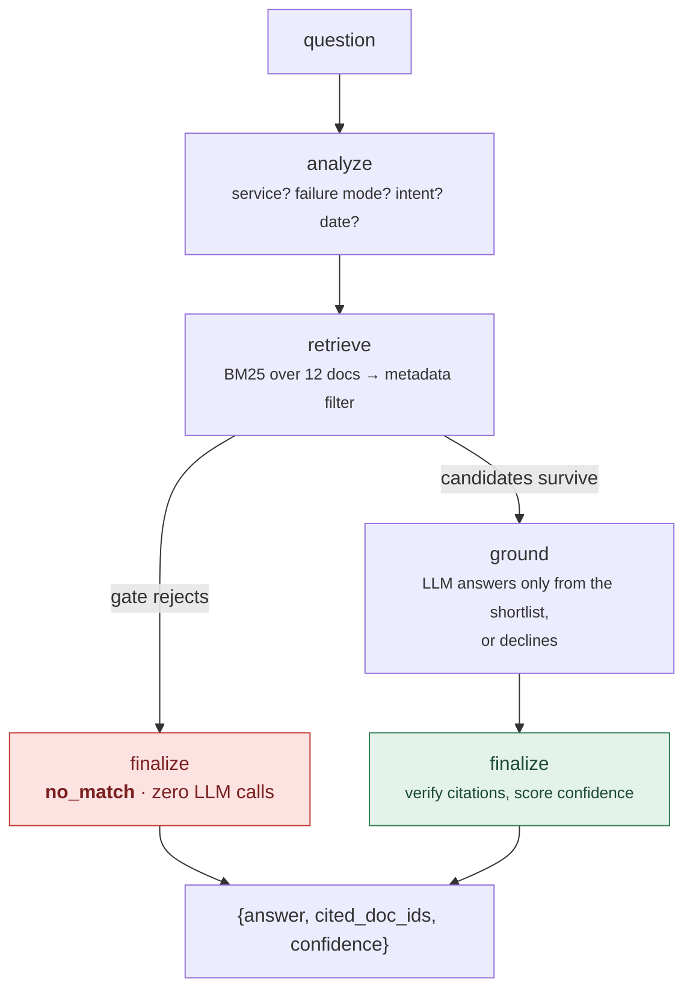

# Architecture Overview

## The problem, restated

The corpus is built as a trap. It contains document pairs like:

```
RB-001  checkout-api — High CPU
RB-003  payments-api — High CPU      ← different SERVICE, same failure
RB-004  checkout-api — Memory / OOM  ← same SERVICE, different failure
```

Roughly 90% of the words are shared between these documents. **The only tokens
that determine the correct answer are the service name and the failure
mode.** That is not a retrieval problem in the usual sense — it is a
*discrimination* problem: telling apart two texts that mean almost the same
thing except in the one dimension that matters.

## Why not embeddings? { #why-not-embeddings }

The default modern instinct is to embed everything into vectors and return
the nearest neighbours. Against this corpus, that approach is at its
**weakest**:

- An embedding model is explicitly trained to map paraphrases to nearby
  points — that is its entire purpose.
- RB-001 and RB-003 differ by a handful of words. Their vectors land on top of
  each other; cosine similarity sits around 0.95+.
- The signal that actually decides the answer is a 1–2 token difference,
  which is precisely what the embedding has averaged away.

Groq's free tier also has no confirmed embeddings endpoint, so this isn't only
a design preference — it lines up with the zero-budget constraint.

## What works instead

Two signals that *do* preserve the distinction:

| Signal | Job | Why it works |
|---|---|---|
| **BM25** | Ranks | Scores literal tokens, so it cannot blur `checkout-api` into `payments-api` — to BM25 they are simply different strings. |
| **Metadata filter** | Discriminates | A wrong service is a *contradiction*, not a weak signal to be outvoted by 400 words of similar prose. It drops, it does not penalise. |
| **The gate** | Decides whether to answer | If nothing credible survives, the model is never called. |

**Turn the distinguishing features into structured fields and filter on them,
instead of hoping a similarity score notices them.** That sentence is the
design decision the rest of the system exists to support.

## The pipeline



The gate is a **conditional edge in a LangGraph state graph**, not an `if`
inside a function (see [`agent/graph.py`](../architecture/components.md#the-graph-agentgraphpy)).
That makes "we do not call the model when nothing survived" a declared
property of the structure rather than a branch buried in a call stack — and
it is a safety guarantee, not an optimisation. **A model that is never shown a
document cannot invent a citation for one.**

## Two independent chances to decline

1. **The gate** catches questions whose vocabulary is nowhere in the corpus
   (the coverage floor) or whose best lexical score is too weak (the lexical
   floor). Zero LLM calls on this path.
2. **The model** catches questions that retrieved something plausible but
   don't actually apply. Its prompt states plainly that returning no
   citations is a correct and expected answer — the second gate only works if
   the model has explicit permission to use it.

This matters because the two failure modes it guards against need opposite
fixes: an agent that never declines, and one that declines too readily, can
score identically on overall accuracy while needing the gate floor moved in
opposite directions. See [Evaluation → The Scoring Model](../evaluation/scoring.md).

## Layout on disk

```
agent/
  api.py            answer_question()  <- the entry point
  graph.py           LangGraph StateGraph; the gate as a conditional edge
  state.py           what flows between nodes
  core/               PURE functions - no LangGraph, no network, no I/O
    corpus.py         parse runbooks/*.md front-matter into Doc records
    query.py          question -> QuerySpec (service, failure mode, intent, date)
    retrieve.py       BM25 + dense + RRF + metadata filter + gate  <- the important one
    chunk.py          split on ## headings; cite the parent doc_id
    confidence.py     high | medium | low | no_match
  nodes/              thin adapters: unpack state, call a core fn, write back
    ground.py         the grounding prompt, and citation verification
    grade.py          the CRAG relevance grader and query rewriter
  store/              Store protocol -> FileStore | SupabaseStore
  embed.py            one Embedder interface: fastembed | Gemini | none
  cache.py            exact-answer cache (and why there is no semantic one)
  observability.py    Langfuse export, off unless configured
  llm.py              Groq client: 429 backoff, defensive JSON parsing
  config.py           every tuned constant and model ID

config/               local.json, dev.json - committed, no secrets
app/                  FastAPI surface (thin by design)
web/                  single-page UI
ingest/               offline pipeline: Cloudinary -> parse -> chunk -> embed
supabase/migrations   single-query hybrid search, in SQL
baseline/             the no-retrieval control arm
eval/                 questions, harness, scorer, retrieval-only scorer
runbooks/             RB-001.md .. RB-012.md
tests/                261 tests, all offline
```

`agent/core/` imports nothing heavy on purpose. That is what keeps the test
suite for the component that wins this exercise fast, and runnable on a
machine with no keys and no internet.

## The stack, and why

| Layer | Choice | Why this one |
|---|---|---|
| Generation | Groq `openai/gpt-oss-120b` | Production model, 8k TPM free — about two questions a minute |
| Reasoning arm | Groq `qwen/qwen3.8-27b` | Selectable per request. Preview model, so its ID lives in [config](../reference/configuration.md) |
| Grading | Groq `openai/gpt-oss-20b` | Cheapest and fastest |
| Lexical | `rank_bm25` locally, Postgres `ts_rank_cd` deployed | Same interface, two backends |
| Embeddings (local) | `fastembed` / `bge-small-en-v1.5`, 384d ONNX | Deterministic, offline, un-rate-limited - so the harness is reproducible |
| Embeddings (deployed) | `gemini-embedding-001` @ 768d | Real query/document asymmetry, and no 200MB of onnxruntime in the bundle |
| Store | Supabase Postgres + pgvector | Dense, full-text and the metadata filter in **one SQL statement** |
| Object store | Cloudinary (`resource_type: raw`) | Free accounts block PDF delivery by default; raw is not subject to that rule |
| Hosting | Vercel Python runtime | 500MB bundle limit, generous max duration |
| Orchestration | LangGraph | Earns its place at the conditional edges, not the happy path |

Everything runs on free tiers. Groq has no embeddings endpoint, which is why
embeddings come from Google instead.

Supabase, Cloudinary and Langfuse are talked to over stdlib `urllib` rather
than their SDKs: those packages drag in large dependency trees for what amounts
to a few JSON POSTs, Vercel's bundler does no tree-shaking, and the bundle
limit is real.
