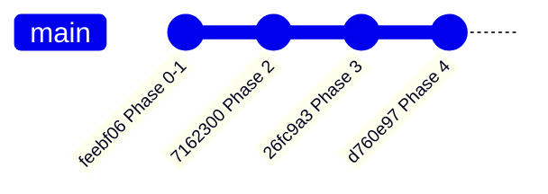

# Development History

The build order is itself part of the design: the corpus and the evaluation
questions were frozen **before** any retrieval code existed, so there was no
opportunity — conscious or not — to tune the retriever to documents it had
already been tested against. Four commits, each a complete, tested phase.

## Phase 0–1 — foundations, corpus, and the frozen evaluation set

**`feebf06`** · 37 files · 30 tests passing

- **Phase 0 (skeleton):** the pure dataclasses (`Doc`, `Chunk`, `QuerySpec`,
  `Candidate`, `Answer`) with no heavy imports, so the retrieval tests stay
  offline; `agent/config.py` centralising every tuned constant and model ID
  (models are addressed by *role* — generator / reasoner / grader — never by
  name, because `qwen3.8-27b` is a preview model that can change without
  notice); `agent/llm.py` with 429 retry-with-backoff and defensive JSON
  extraction; a FastAPI surface with `/health` doubling as a keep-alive
  endpoint for Supabase's 7-day idle pause.
- **Phase 1 (the data, frozen before any retriever exists):** twelve
  runbooks authored with the near-duplicate traps the exercise is built
  around, with measured token overlap — **69%** between RB-001/RB-003 (same
  failure, different service), **73%** between RB-002/RB-007, **77%**
  between RB-005/RB-006, **41%** between RB-001/RB-004 (same service,
  different failure). Every heavily-overlapping pair is separated by at
  least one metadata field, and that claim is asserted directly in a test.
  RB-012's root cause is connection-pool exhaustion — the fact that makes the
  brief's "citing RB-012 as well is good, not required" coherent.
  `eval/questions.py` adds the 5 given questions plus 15 held-out (10
  answerable, 5 `no_match`), two of which are deliberate vocabulary
  mismatches expected to fail under lexical-only retrieval — written to
  justify adding embeddings later, before any score could bias that
  decision.

## Phase 2 — retrieval core: BM25, the metadata filter, and the gate

**`7162300`** · +1,055/−3 lines · 79 tests passing

Pure functions only — no network, no LangGraph. **18 of 20 evaluation
questions get the right document at rank 1 from retrieval alone**, before any
LLM is involved.

- The filter defeats the near-duplicate trap by **dropping**, not
  penalising: a wrong service is a contradiction, not a weak signal to be
  outvoted by four hundred words of similar prose.
- Two rules pinned by tests because they're easy to get wrong: documents with
  `service=None` (policy docs) are never dropped for mismatching a named
  service, and documents with `failure_mode=None` (rollback runbooks) are
  never dropped for mismatching a failure mode.
- **Measured, not assumed — finding 1:** general docs were outranking
  service-specific ones on raw BM25 score (a company-wide deploy process
  shares more words with "how do I roll back checkout-api" than the
  checkout-specific document does). Fixed with a specificity tie-break that
  preserves BM25's ordering within each group.
- **Measured, not assumed — finding 2:** an IDF-weighted gate coverage signal
  was tried and reverted after it gated six correct answers — see
  [Gate Calibration](evaluation/gate-calibration.md#an-idea-that-was-tried-and-reverted).

## Phase 3 — the LangGraph agent and `answer_question()`

**`26fc9a3`** · +854/−2 lines · 98 tests passing, all offline

The entry point the brief specifies works end to end. LangGraph lives
*inside* `answer_question()` rather than around it — the graph is an
implementation detail, the function signature is the contract, and the CLI,
HTTP surface, and (next phase) harness all call the same function.

- The gate becomes a **conditional edge**, not an `if` inside a function —
  making "we do not call the model when nothing survived" a declared
  property of the graph's structure. Asserted directly: gated questions
  record `llm_calls == 0`.
- Citation verification strips any ID the model was never actually shown.
- The grounding prompt states plainly that declining is correct and
  expected — the second gate only works if the model has explicit permission
  to use it.
- Confidence scoring doesn't penalise a policy question answered by a policy
  doc — matching nothing structural is the *expected* shape of a good answer
  there, not a weak one.
- A missing `GROQ_API_KEY` prints guidance instead of a traceback, and every
  path that can decline without a model still works with no key at all.
- The model is stubbed in tests, so the 98 tests measure the system's wiring,
  not Groq's behaviour on any given day.

## Phase 4 — evaluation harness, control arm, gate calibration, README

**`d760e97`** · +1,090 lines · 112 tests passing, all offline

- The harness reports a machine-readable score against `(question,
  expected_doc_ids or none)` pairs, calling `answer_question()` directly —
  no server involved, so the thing measured is the thing deployed.
- Scoring adds `PARTIAL` to the brief's four named outcomes, pinned by
  `test_the_two_failure_modes_are_visible_separately` — see
  [The Scoring Model](evaluation/scoring.md).
- An extra citation the brief explicitly permits (RB-012 on question 2)
  scores as correct, not as noise.
- The gate floor sweep (retrieval only, no key needed) identifies **0.60** as
  the knee — see [Gate Calibration](evaluation/gate-calibration.md).
- `baseline/stuff_all.py` adds the no-retrieval control arm, deliberately
  given an advantage (all twelve documents fit in one context window, which
  they would not at a realistic corpus size) — so that if the simple approach
  ever won, that would be reported honestly rather than hidden.
- Still needed to produce `harness_output.json` at this point: a
  `GROQ_API_KEY`. Retrieval, filtering, gating, scoring, and the full test
  suite all run without one.

---

Scaffolding for later phases — dense retrieval (`ingest/`), a Postgres-backed
store (`supabase/`), and a web front end (`web/`) — exists in the repository
but had not yet been committed as of this documentation's writing. Treat
anything not listed above as **not yet implemented**, not as a completed
phase.
